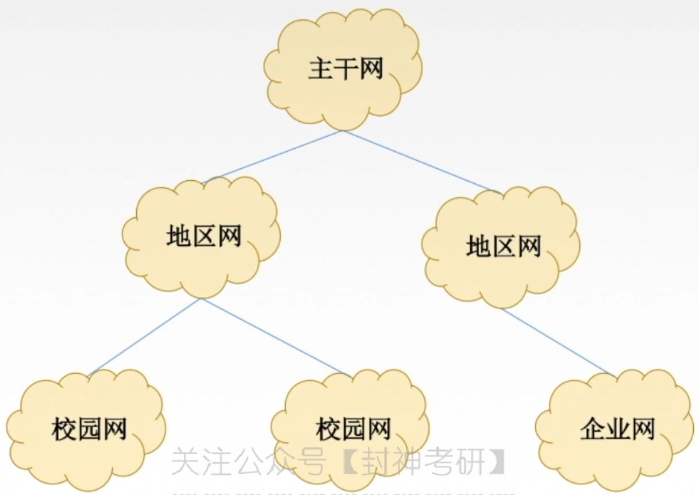

# 计算机网络概论

## <u>网络学习的背景了解</u>

1. 多处理器系统和分布式：

* 多处理器系统：多个处理器通过共享内存实现的紧耦合系统

* 分布式系统：

2. 工作站和服务器：工作站和服务器都是高性能计算机

* 工作站：处理数据快，处理能力强
* 服务器：稳定，持久，不容易宕机 

## <u>一些网络的基本知识</u>

1. 计算机网络是**==通信技术==**和**==计算机技术==**结合

* 计算机技术：IT (Information Technology)
* 通信技术：CT (Communication Technology)AA
* 计算机通信技术：ICT (Information Communication Technology)

2. 主机（端系统）是指计算机除去输入输出设备以外的主要机体部分

3. 节点，网络，互联网，因特网

* 结点：计算机网络中每一台主机，或者交换设备都是一个结点
* 网络：把多个节点连接起来
* 互联网 (internet: interconnected network)：把多个网络连接起来
* 因特网 (Internet)：世界上最大的互联网

4. 网络类型有：计算机网络，电信网络（电话网），有线电视网（电视网）

* **三网合一/三网融合**：以计算机网络为基础，将这三个网络进行融合
  * 基本原理：将一些图像或者音频，转化为电信号或者光信号，再放在计算机网络介质中进行传输。因此计算机网络是三网融合的基础。 

## <u>计算机网络的基本概念</u>

计算机网络：计算机网络是一个将分散的、==具有独立功能==的==计算机系统==，通过==通信设备和线路==连接起来，由功能完善的==软件==协助，来实现==资源共享和信息传递==的系统。

1. 定义的三个关键点：自治，互连，集合体

* 自治：各个计算机系统之间没有主从关系。
* 互连：计算机之间可以相互通信。
* 集合体：计算机网络是一个==计算机系统的集合==：因此其必须包含多台计算机，一台计算机肯定组不成计算机网络。

2. 通信线路：可以分为逻辑线路和物理线路

* 逻辑线路：设备之间不直接通过线路连接，比如手机和手机之间连接WIFI。

* 物理线路：直接用网线把设备连接起来。

3. 根据计算机的发展经历，计算机网络逐渐形成三种定义 / 或者叫三种理解

* 广义观点
* 资源共享观点
* 用户透明观点

**注意：计算机网络具有分布式处理的功能，但它不是分布式系统**。它的设计实际上是使计算机之间更紧密，不是相对独立

## <u>计算机网络的组成</u>

一个完整的计算机网络由==**硬件、软件、协议**==三大部分组成，缺哪一部分都是不可以的。

* 硬件：包含主机，通信链路和通信设备
* 软件：软件大多属于应用层，其他部分也会存在
* 协议：协议是计算机网络的核心,规定了网络传输数据所需要遵守的规范

## <u>计算机网络的功能</u>

### 1. 数据通信

计算机网络==最基本，最重要==的功能,同时也是==实现其他功能的基础==。

其本质说白了就是在同一计算机网络之间进行传输数据的传递。

### 2. 资源共享

计算机网络的目的：资源共享

资源共享是指同一个计算机网络的其他计算机可以使用某台计算机的资源

注意共享：可以是==硬件、软件、数据==的共享

* 硬件：比如打印机
* 软件：大家可以下载网络上的文件

资源共享可以提高网络中资源的利用率

### 3. 分布式处理

分布式处理是指：多台计算机各自承担同一任务的不同部分。

* 当网络中某个计算机系统负荷过重，则会把任务的某个部分分配给其他空闲的计算机系统。
* 分布式处理可以提高整个系统的利用率。

例子：Hadoop 平台

### 4. 提高可靠性

网络中的各台计算机可以通过网络互为替代机。如果一台网络发生宕机，则可以使用其他的机器来完成他的功能

### 5. 负载均衡

将工作任务均衡的分配给计算机网络中的计算机，让每台计算机工作的安排都相对合理

> 三大主要功能：==数据通信、资源共享、分布式处理==
>
> 数据通信是其他所有功能的基础
>
> 可靠性、负载均衡都是基于分布式处理而衍生出来的功能，分布式处理是他们的基础

### 6. 其他功能

提到其他功能，也是可能正确的

## <u>计算机网络的发展阶段</u>

第一阶段：美国国防部：ARPANet（阿帕网）

* ARPANet 是因特网（Internet）的前身，世界上第一个网络。
* ARPNet 使用了TCP/IP协议

第二阶段：三级结构因特网

* 美国国家科学基金会NSF，国家科学基金网 NSFNET
* 第一层：校园网/企业网。第二层：地区网 第三层：主干网。  
* 

第三阶段：多层次 ISP (Internet Service Provider) 因特网

* ISP 因特网服务提供商，比如移动电信联通
* 分为主干ISP、地区ISP、本地ISP。校园网/企业网开始由ISP负责。然后ISP分为主干、地区、本地ISP。

网络的权利分散，由ISP进行网络的管理

IXP 因特网交换点。由了他，就不需要其他ISP进行转发分组，而直接由两个网络直接相连进行数据交换。

## <u>计算机网络（因特网）的分类</u>

### 1. 从组成上分 / 工作方式上

（功能）组成上分为：通信子网和资源子网。

工作方式上分为：边缘部分和核心部分。

> 他们两者其实是差不多的，包含的事物也是差不多的

通信子网/核心部分：包括通信设备和通信链路。一般网络中的通信设备，如==交换机、网卡、路由器==又叫做通信节点

* 功能：为资源子网 / 边缘部分提供==连通性和数据通信==服务
* 占据下三层：==网络层、数据链路层、物理层==

资源子网/边缘部分：链接在网络中的服务器、主机、移动端（手机，Pad）、网络摄像头，以及这些设备中包含的所有设备和软件都算

* 实现资源共享

* 占据上三层：==会话层、表示层、应用层==

注意，运输层既不属于通信子网，也不属于资源子网，是孤立的 

> 注意一般我们说主机A和主机B进行通信，其实是A的进程和B的进程之间进行通信。

主机间进行数据通信/资源共享一般有两种方式：

* C/S-Client/Server方式（B/S）Browser/Server方式是C/S的特例：
  * Server 是提供服务的，Brower/client都是使用服务的
  * 由于资源有限，用户越多，下载越慢。 
* P2P方式：Peer to Peer 对等链接方式
  * 每一个网络中的主机他在网络中的地位是相同的，他既可以是服务器，也可以是客户机。
  * 一个网络中存在的主机越多，其下载的速度就越快。

### 2. 按照网络拓扑结构上分

星型，总线型，环形，树形，网状

### 3. 按照网络覆盖范围

PAN (Personal Area Network) 个域网（个人区域网）/ WPAN（Wireless Personal Area Network）无线个人区域网 

* 利用无线技术（wifi、蓝牙等）连接起来的网络。WIFI：wireless fidelity
* 覆盖区域直径约为10m左右

LAN (Local Area Network) 局域网

* 覆盖范围小

MAN (Metropolitan Area Network)城域网

* ==覆盖几个街区到一座城市==，注意：不是多个城市，最多一座城市
* 城域网多使用==以太网==技术。

WAN (wide Area Network)广域网 / 远程网

* 因特网的核心

> 局域网和广域网的划分依据不在于距离，而是使用的技术；
>
> * 局域网一般使用广播技术，广域网一般使用交换技术（点对点技术） 
>
> 或者更深层的说，是使用协议的不同决定了他们的分别。

**注意若中央处理器的距离非常近，1m的数量级或者更小，一般我们说这个叫多处理器系统，而不是计算机网络。**

### 4. 按照交换技术

电路交换，报文交换，分组交换

### 5. 按照传输技术

广播式网络：

* 所有链接在此网络上的计算机都享用一个==公共信道==。
* 一台计算机发送报文分组，所有的计算机都会收听到这个分组，但是由固定协议决定谁来接受。
* 局域网基本上都采用广播式网络，广域网的广播、卫星也采用广播式

点对点网络：

* 使用==分组存储转发==和==路由选择==机制：如果两个节点没有直接连接的线路，则他们之间要通。。。
* 广域网基本上都采用点对点网络

> 是否采用==分组储存转发==和==路由选择==是这两种网络的根本区别

### 5. 其他分类

采用协议分类：IP网，IPX网

按照传输介质分类：有线网和无线网

* 有线网可以分为：双绞线网，同轴电缆网，光纤网
* 无线网：蓝牙、微博、无线电网络

用途分类、使用者：公用网（public network），专用网（private network）

# 计算机网络体系结构和参考模型

## <u>分层的基本原则</u>

1. 各层之间相互独立，每层只实现一种相互独立的功能。
2. 每层之间界面自然清晰，易于理解，相互交流尽可能少。
3. 结构上可以分隔开，每层都采用最合适的技术来实现
4. 保持下层对上层的独立性，上层单向使用下层提供的服务。
5. 分层结构应该要促进标准化工作。

## <u>计算机网络的分层体系结构</u>

1. 网络的体系结构（Architecture）：计算机网络的各层次 + 各层的协议 + 层间接口的集合。

* 体系结构就是描述 计算机网络和他应该完成的功能的定义。
* 体系结构是抽象的，实现（Implementation）是具体的，实现是由具体的硬件和软件完成的。

2. 将计算机的网络从==低层到高层==依次分为第1层，第2层,...,第n层，每一层都有一个特定的名字。

* 第n层的实体：第n层的活动元素。可以理解为任何可以发送或接受信息的硬件或者软件进程。

* 对等层：不同机器的同一层。对等实体：处于同一层的实体。

* 第n层实现服务要被第n+1层所利用。因此，第n层为服务提供者，第n+1层服务于其它层或者用户

## <u>协议、接口、服务</u>

### 协议（网络协议） Network Protocol

1. 协议：规则的集合。协议是计算机网络的核心,规定了网络传输数据所需要遵守的规范。
2. 协议是==水平方向==上的。它必须控制==对等实体==，处于不同层之间的不对等实体是不能有协议的。

3. 协议三要素：语法、语义、同步

* 语法：数据传输的格式
* 语义：要完成的功能
* 同步：控制各种操作的完成的条件和顺序关系

### 接口 interface

1. 同一个结点相邻两层间信息交换的连接点。SAP就是一种接口。
2. 接口是==垂直方向==上的，并且只能相邻两层定义，不能跨层定义。
3. 同一个结点相邻两层的实体，通过服务访问点（Service Access Point SAP）这个接口进行交互。他是一个逻辑接口，并不是传统意义上的物理接口。

* 服务是下层通过SAP提供给上层访问的。也就是说，第n+1层可以通过第n层的SAP使用第n层的服务

### 服务 Service

1. 服务：下层为紧相邻的上层提供的功能调用，是==垂直方向==的。 

* 服务是单向的，只有下层为  层提供服务，不能上层为下层提供服务

物理层：集线器，中继器

数据链路层：交换机，网桥

网络层：路由器

会话层，应用层，表示层都是一些软件，其中软件大多数集中在应用层 

